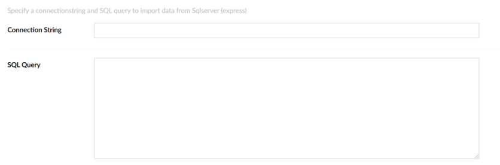

# UI fields

CMSImport builds the settings UI of [data providers](data-providers.md) and
[advanced setting providers](advanced-setting-providers.md) from attributes on their options class.

For example, this property renders a text box for a connection string:

```csharp
[TextBoxField(Name = "Connection string")]
public string ConnectionString { get; set; }
```



## Available attributes

All attributes are in the `CMSImport.Core.Attributes.EditorFields` namespace.

| Attribute | Property type | Renders |
|---|---|---|
| `BooleanField` | `bool` | A toggle. |
| `ContentPicker` | `string` | A content picker. |
| `DatasourcePicker` | `FileOrUrlPickerModel` | A file upload or URL field. |
| `DateFormatField` | `string` | A date format field. |
| `DropDownField` | `DropDownModel` | A drop-down list. |
| `HiddenField` | `string` | A hidden field. |
| `LabelField` | `string` | A read-only label. |
| `MediaPicker` | `string` | A media picker. |
| `MemberGroupOrColumnPickerField` | `List<string>` | A picker for Member Groups. |
| `SmallTextBoxField` | `string` | A small text box. |
| `TextBoxField` | `string` | A text box. |
| `TextAreaField` | `string` | A text area. |

## Validation

Use the standard .NET validation attributes to validate a value:

```csharp
[Required(ErrorMessage = "Connection string is required")]
[TextBoxField(Name = "Connection string")]
public string ConnectionString { get; set; }
```

For a `DatasourcePicker`, use `[FileModelValidation]` from `CMSImport.Core.Attributes.ValidationAttributes`.
