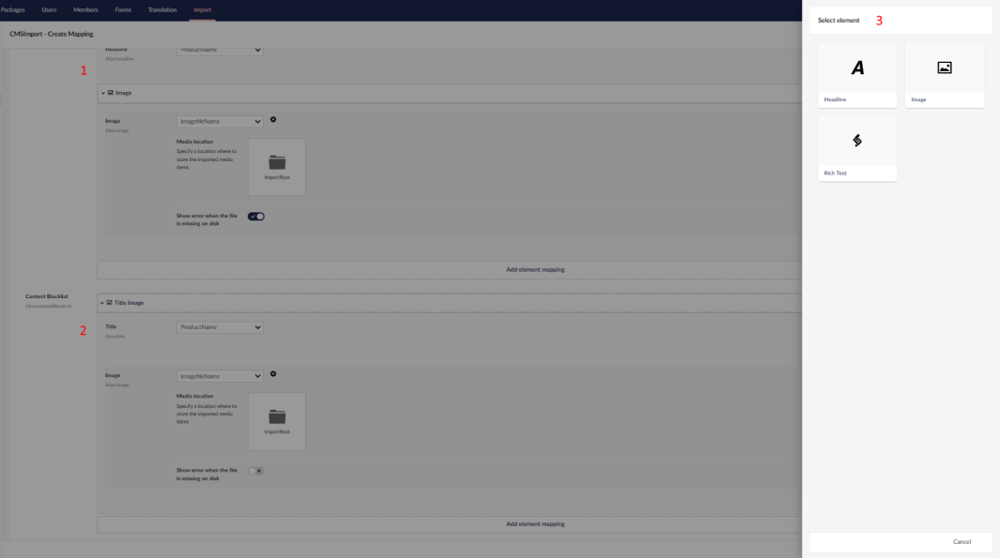

# Block editor mapping

You can map data source fields to the blocks of a Block Grid or Block List property.

The numbers in the screenshot match the list below:

1. **Block Grid mapping.** Pick a block and map data source fields to its properties, the same way you map a
   normal document. Click **Add Element Mapping** to add a block. You can sort the blocks after adding them.
2. **Block List mapping.** Works the same as Block Grid mapping.
3. **Element picker.** Select the Element Type (block) to add. Only the blocks allowed for the property are
   listed.

## Limitations

!!! warning "Nested blocks are not supported"
    A block that itself contains a Block List or Block Grid property can't be mapped.
