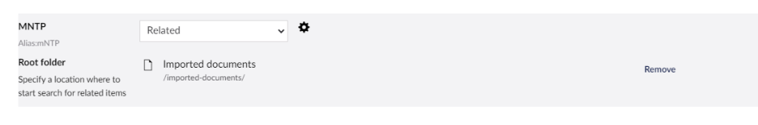

# Lookups

CMSImport can look up existing content for Multinode Treepicker properties.

## How it works

CMSImport uses the configuration of the Multinode Treepicker Data Type to decide where to look for content.

For each value in the data source, CMSImport looks for a matching node by ID or by node name. When it finds
one, it adds that node to the picker. When it can't find a match, the value is ignored.

In the example below, the data source value `Hitch Rack - 4-Bike` was linked to the **Bikes** page.

!!! note "Run the import twice for forward references"
    When a record refers to a page that hasn't been imported yet, the relation is skipped. Run the import again to
    add those relations.
