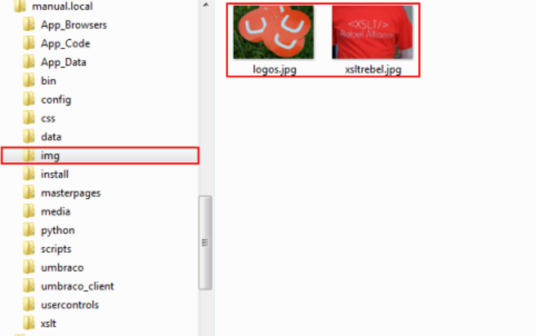
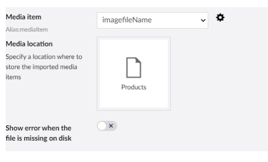
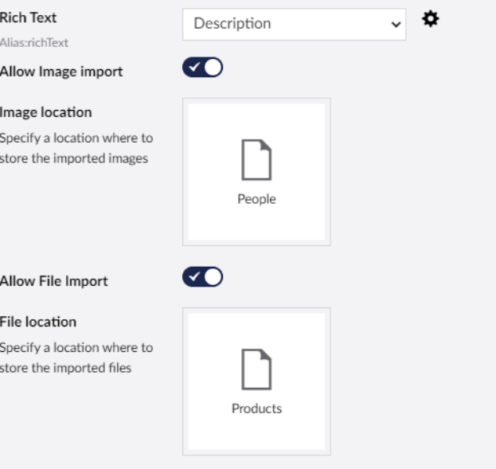
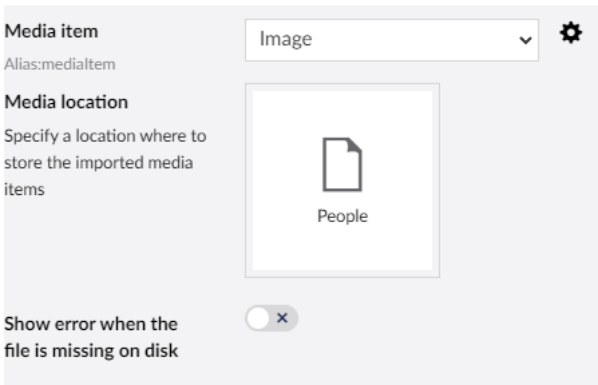

# Related media import

CMSImport imports media that your content or members refer to. This is not a separate import: it happens while
you import content or members.

When CMSImport finds a relative path to a file, it creates a media item for it. For an upload field it stores
the file in the media folder instead. When the path points to a folder, CMSImport imports the complete folder and
assigns the folder, if the property editor allows that.

!!! warning "Copy the original media files first"
    Copy the original media folder into the media import location of your site before you run the import. By
    default this is `wwwroot`. You can change it with
    [`MediaImportLocation`](../configuration.md#mediaimportlocation).

In the example below, the `img` folder of the original site, with two images, is copied to the import location.

Use the settings icon next to the media mapping to set where the media is stored in Umbraco.

## Rich Text Editor

When you map to a Rich Text Editor, set the import options as shown below. For each image in the content,
CMSImport creates a media item and updates the image source to point to it.

Which file links are imported is controlled by
[`AllowedFileExtensions`](../configuration.md#allowedfileextensions) and
[`AllowedDomains`](../configuration.md#alloweddomains).

## Media Picker

When you map to a Media Picker, CMSImport creates a media item and stores a reference to it. Select **Show error
when file is missing on disk** to get an error when the data source refers to a file that isn't there.

## Upload field and Image Cropper

When a file is mapped to an upload field or Image Cropper, CMSImport stores the file in the Umbraco media folder
and updates the reference in the property.

## Supported property editors

Related media import works for:

- Upload field
- Media Picker (single and multiple)
- Multinode Treepicker (media only)
- Image Cropper
- Rich Text Editor
