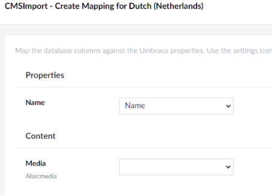

# Multilingual mapping

When the Document Type varies by culture, the mapping step is split into one step per language.

Each step shows the language you are mapping, and only lists the properties that vary by culture.

