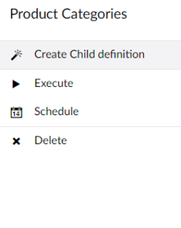
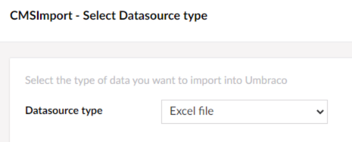
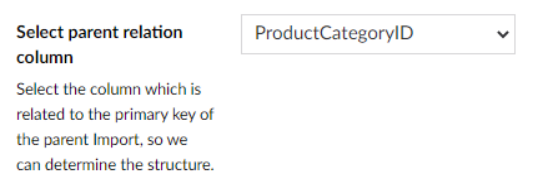
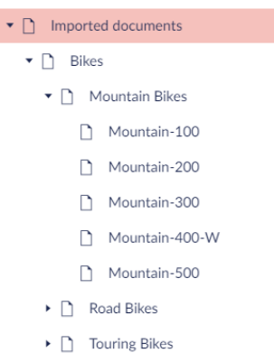

# Structured content import

Use child import definitions to import data with a parent–child structure, such as product categories and their
products.

In this example, a saved import definition **ProductCategory** imports product categories. A child definition
then imports the products into the right category.

## Create a child definition

1. In the **Import definitions** tree, open the actions menu of the parent definition (here **ProductCategory**).
2. Select **Create child definition**.

    

The import wizard starts again, with a few differences described below.

### Select the data source

When you pick the same data source type as the parent, the wizard selects the parent's data source for you.

### Set the content import options

You don't choose a location, because each item is stored under its parent record. Instead you set the
**parent relation key**: the field that links a record to its parent. In this example that is
`ProductCategoryId`.

All other steps are the same as in the [import wizard](wizard.md).

## Result

When you run the parent definition, the content tree is filled with the categories and their products.

The **Import definitions** tree shows **Products** as a child of **ProductCategory**.

!!! note
    Running a parent definition also runs its child definitions.
