# Import wizard

The import wizard walks you through an import, step by step. This page describes each step.

To start the wizard, go to the **Import** section, open **CMSImport** and select **Import data**.

## 1. Select the import type

Choose what you want to import: **Content**, **Member** or **Dictionary items**.

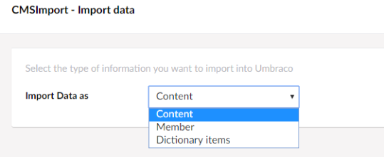

## 2. Select the data source type

Choose the type of data you want to import.

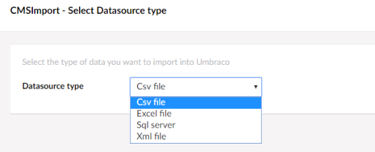

The available types are listed in [Supported data sources](../index.md#supported-data-sources).
BlogML, WordPress, RSS feed and JSON file need an [extra package](../installation.md#add-extra-data-sources).
You can also [create your own data source type](../extending/data-providers.md).

## 3. Select the data source

Enter the details for the selected data source type. The options differ per type. In general you select a file,
enter a URL, or enter a connection string so CMSImport can read the data.

For an Excel file, upload an `.xls` or `.xlsx` file or point to its location. Click **Next**, then pick the
worksheet from the drop-down.

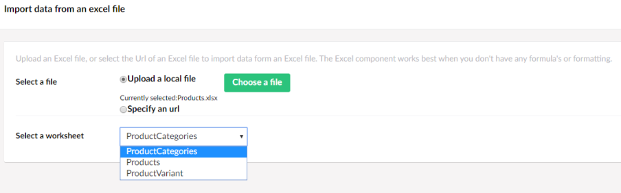

## 4. Set the import options

The options in this step depend on the import type you selected in step 1.

### Content import options

#### Location and Document Type

Choose where in the content tree to store the imported documents, and which Document Type to use. Select
**Auto publish** to publish the imported items automatically.

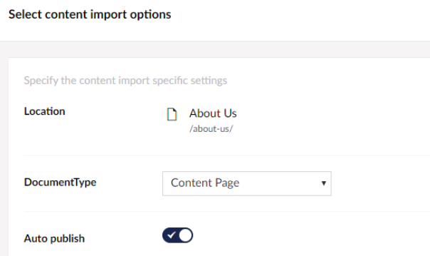

#### Update options

These options let you run the same import again and update content that was imported earlier.

- **When the record already exists** — choose **Skip** or **Update record**.
- **Select primary key in datasource** — the field in the data source that identifies a record. CMSImport uses
  it to see whether a record was already imported.

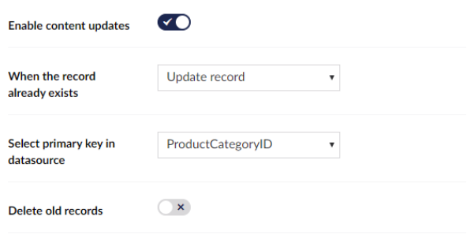

!!! warning
    Only clear **Enable content updates** when your data source has no primary key. CMSImport then stores no
    relation between the source record and the Umbraco document. When you run the import again, every record is
    imported as a new document.

#### Recursive options

CMSImport can keep the structure of your data. Normally you do this with
[parent and child import definitions](structured-content.md). Sometimes the data refers to itself instead, for
example product categories that have a parent category.

Select the recursive import option and choose the field that holds the key of the parent record, for example
`ParentProductCategoryID`.

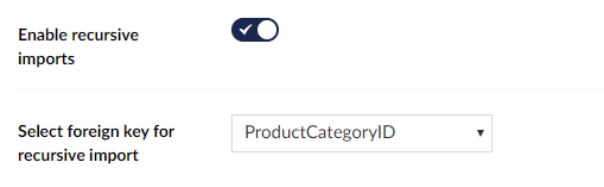

!!! note
    When you run this step for a child import definition, some options are disabled and a few extra options
    appear. See [Structured content import](structured-content.md).

#### Delete old records

Select **Delete old records** to remove items whose records are no longer in the data source. CMSImport checks
this during the import, based on the data source type, primary key name and primary key value.

!!! warning
    Make sure this combination is unique when you have multiple import definitions. Otherwise CMSImport can
    delete records that came from a different data source.

### Member import options

- **Member type** — the Member Type of the imported members.
- **Automatic assign role(s)** — the Member Group to add the imported members to.
- **When member exists** — choose **Skip** or **Update record**.
- **Automatic generate password** — generates a password for each imported member.
- **Send credentials via mail** — emails the login details to each imported member. You can change the email
  template; see [Configuration](../configuration.md#login-credentials-mail).
- **Delete old records** — works the same as for [content](#delete-old-records).

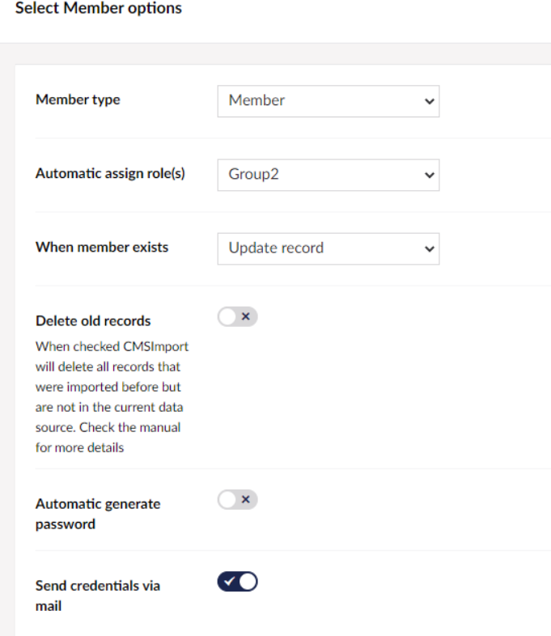

### Dictionary import options

- **When the item already exists** — choose **Update** or **Skip**.
- **Delete old records** — works the same as for [content](#delete-old-records).

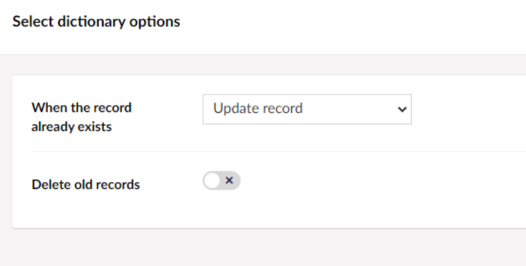

## 5. Create the mapping

Map each field from the data source to a property of the Umbraco Document Type.

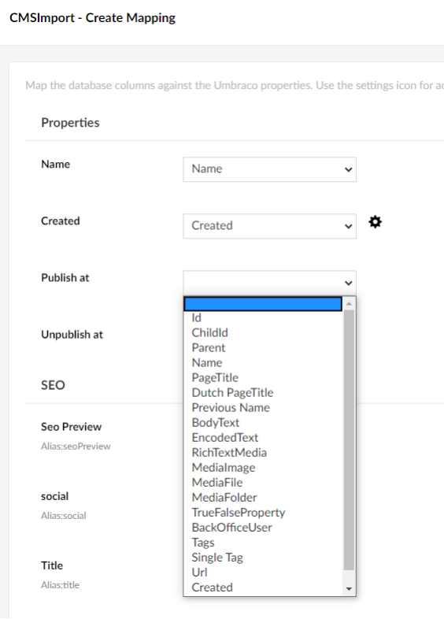

!!! tip
    When a field name in the data source is the same as the alias of a property, CMSImport maps it automatically.

Some property types need more mapping:

- **Block Grid and Block List** — see [Block editor mapping](block-editors.md).
- **Multilingual Document Types** — see [Multilingual mapping](multilingual.md).

### Additional settings

Most property editors have extra options. Click the settings icon next to a mapping to open them. For example,
when you map to a Media Picker or Rich Text Editor, you can set where media is stored and enter a default value.
See [Related media import](media.md).

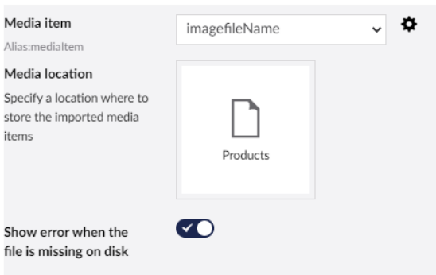

## 6. Confirm

Check the selected options one more time. Click **Next** to start the import.

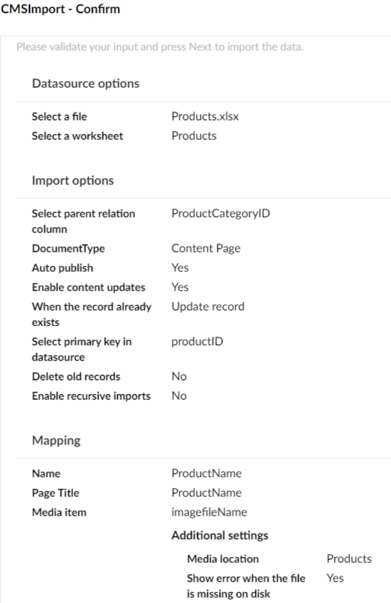

## 7. Import

CMSImport runs the import and reports what it did, including any errors.

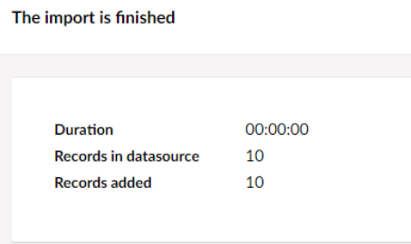

## Save the import

Click **Save**, enter a name and click **Save** again. The wizard steps are stored so you can run the import
later or [schedule it](../scheduling.md). **Create copy** saves a copy of the current import.

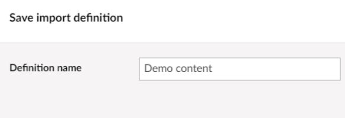

Saved imports are called import definitions. You find them in the **Import definitions** tree.

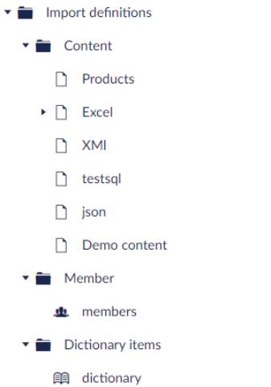
