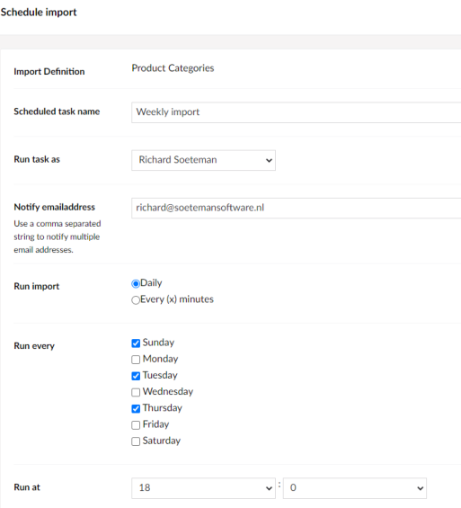
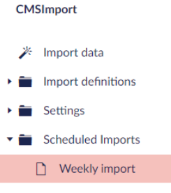

# Schedule imports

You can run a saved import automatically at a set day and time.

## Create a schedule

1. In the **Import definitions** tree, open the actions menu of a saved content or member import.
2. Select **Schedule**.

    

3. Choose how often the import runs:
    - every week, on selected days and at a set time
    - every day, at a set time
    - every hour
4. Optionally, enter an email address to get a notification when the import finishes.
5. Choose the user that is set as the creator of the imported items.
6. Click **Save**.

The import now runs at the selected times. When an email address is set, you get an email after each run. You
can change this email; see [Scheduled task mail](configuration.md#scheduled-task-mail).

## Scheduled task log

To see when a scheduled import ran, open the actions menu of the schedule and view its log.

The time it ran can differ a little from the scheduled time, for example when the site was down at the scheduled
time. When the site comes back up, the scheduler runs any task it missed.
