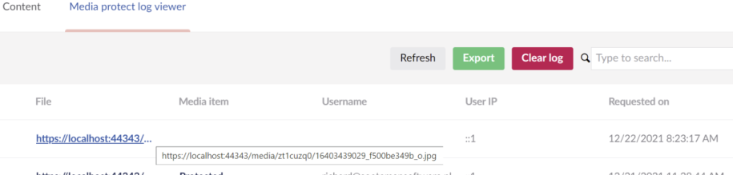
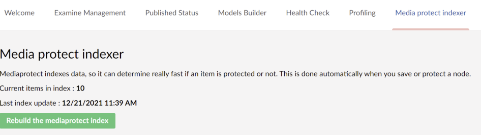

# Dashboards

MediaProtect adds two dashboards to the backoffice.

## Log viewer

Go to the **Media** section and open the **Mediaprotect Log viewer** dashboard.

The log shows which file was requested, the media item, the member, and when the file was requested. You can
refresh the list, export it to CSV, or delete all records.

By default only requests for protected files are logged. To change this, or the CSV format, see
[Logging](configuration.md#logging).

## Indexer

MediaProtect keeps an index of protected media for fast lookups. The index is updated when you change
protection or save a media item.

Go to the **Settings** section and open the **Mediaprotect indexer** dashboard to see when the index was last
updated, or to rebuild it.

