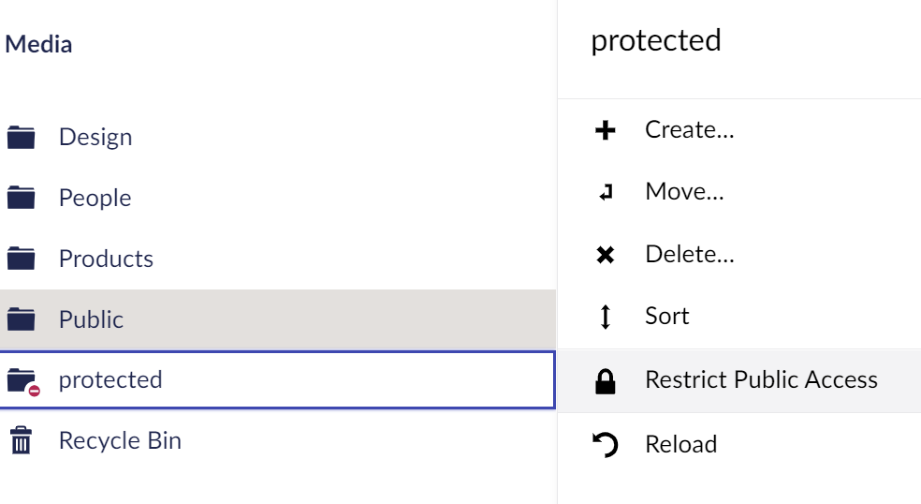
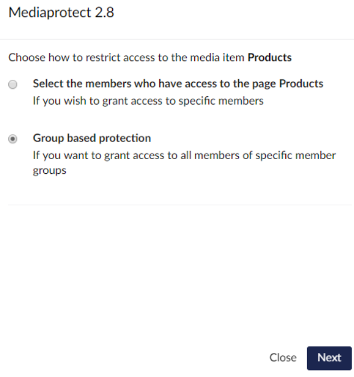
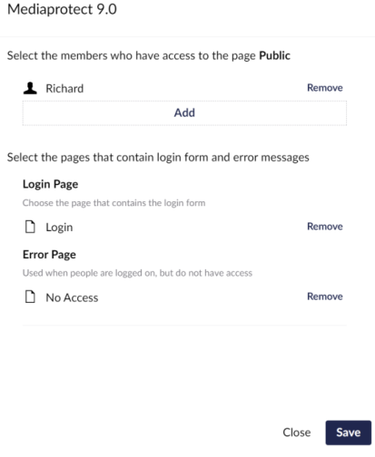
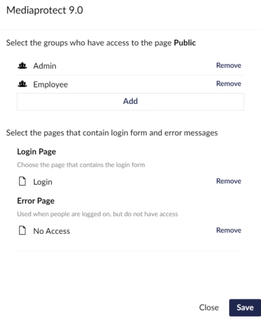
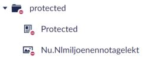

# Protect media

You protect media items and folders from the Media section, with the same options as public access for
content.

## Protect a media item or folder

1. Go to the **Media** section.
2. Open the actions menu of the media item or folder you want to protect and select **Public Access**.

    

3. Choose how to restrict access, then click **Next**:
    - **Specific members protection** — only the members you select have access.
    - **Group based protection** — all members of the member groups you select have access.

    

4. Select the members or member groups that have access.
5. Select the **Login page**. Visitors who aren't logged in are redirected to this page.
6. Select the **Error page**. Members who are logged in but have no access are redirected to this page.
7. Click **Save**.

When you protect a folder, everything inside it is protected too.

!!! note
    You need access to the **Members** section to see the **Public Access** action.

!!! tip
    Set a [default login and error page](configuration.md#defaultloginnode-and-defaulterrornode) so you don't have
    to pick them every time.

## Group based protection

With member groups, you select one or more groups. Every member of those groups has access.

To hide groups from this list, use [`ExcludeRoles`](configuration.md#excluderoles).

## Check the protection

Protected media items have a no-entry sign in the Media tree.

To test it, open the URL of a protected file in a browser:

- When you're not logged in as a member, you're redirected to the login page.
- When you're logged in as a member with access, the file opens.
- When you're logged in as a member without access, you're redirected to the error page.

!!! note
    By default, users who are logged in to the Umbraco backoffice can open protected files. Turn this off with
    [`AllowAccessForUmbracoUsers`](configuration.md#allowaccessforumbracousers) to test as a visitor in the same
    browser.

## Remove protection

Open **Public Access** on the media item again and click **Remove protection**.
