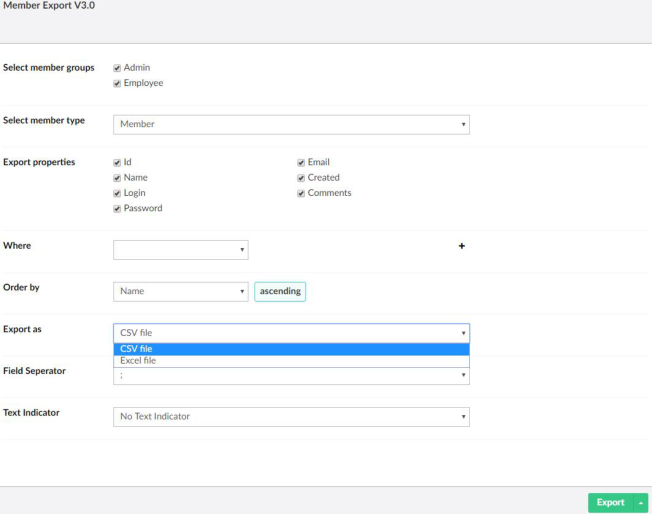
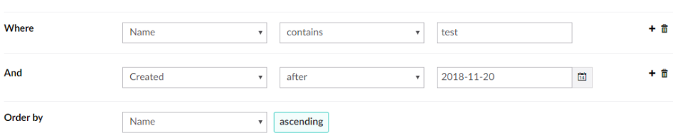
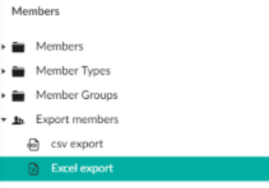

# Export members

Export members from the Members section, and save the export to run it again later.

## Export members

1. Go to the **Members** section.
2. Under **Tools**, open **Export members**.
3. Fill in the export options:
    - **Select member groups** — export only members of these member groups.
    - **Select member type** — the member type to export.
    - **Export properties** — the fields to include in the file.
    - **Where** and **Order by** — optional filters and sorting. See [Filter and sort](#filter-and-sort).
    - **Export as** — **CSV file** or **Excel file**.
    - For CSV: the **Field Seperator** and the **Text Indicator**.
4. Click **Export**. Your browser downloads the file.

!!! tip
    Opening the CSV file in Excel? Use `;` as field separator and `"` as text indicator.

## Filter and sort

Use **Where** to export only the members that match your criteria.

1. Pick a field, a condition and a value, for example **Name** **contains** `test`.
2. Click **+** to add another condition. All conditions must match.
3. Click the trash can to remove a condition.

Use **Order by** to sort the members in the file. Click the sort direction to switch between ascending and
descending.

## Save an export

Click **Save As** and enter a name to save the export options as an export definition. Saved exports appear
below **Export members** in the tree.

A saved export only stores the options. MemberExport creates the file again, with the current members, every
time you run it.

!!! note
    Saving exports needs a PRO license.
