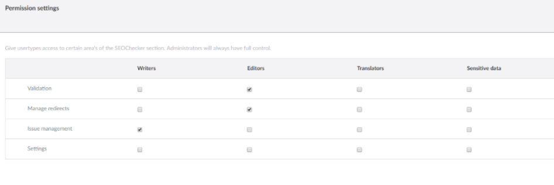
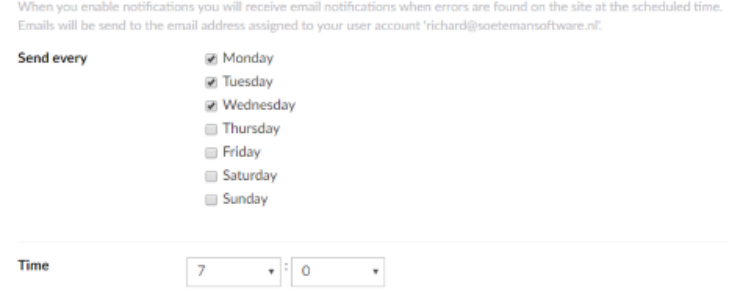
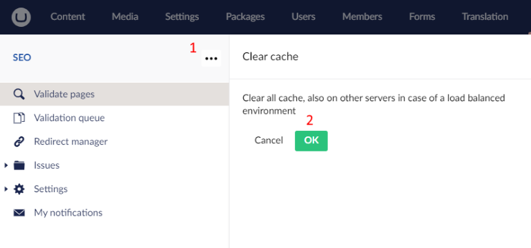

# Backoffice settings

The **Settings** folder in the SEO Checker section holds the ignore lists, user group permissions and email
settings. This page also covers personal notifications and clearing the cache.

## Ignore lists

These lists show the issues that are ignored during validation:

- Ignored validation issues
- Ignored inbound link errors
- Ignored configuration issues

Select items and delete them to remove them from the list. They are reported again at the next validation.

## User group permissions

Set what each user group can do in SEOChecker. Administrators always have access to everything.

## Email settings

### Scheduled task emails

Sent when a [scheduled validation](../validation.md#scheduled-validation) has finished. You can set the from
address, from name, subject and the Razor template for the email body.

The default template is `umbraco/Data/seochecker/mailtemplates/scheduledtask-mail.cshtml`. Change it, or add your
own template to that folder and select it. Your template must use the model
`SEOChecker.Common.Models.Mail.ScheduledTaskNotificationMailModel`.

### User notification emails

Sent for [my notifications](#my-notifications). You can set the same options. The default template is
`umbraco/Data/seochecker/mailtemplates/notification-mail.cshtml`, with the model
`SEOChecker.Common.Models.Mail.NotificationModel`.

!!! note
    Emails are sent with the SMTP settings of your Umbraco site (`Umbraco:CMS:Global:Smtp`). See
    [Global settings](https://docs.umbraco.com/umbraco-cms/reference/configuration/globalsettings) in the
    Umbraco documentation.

## My notifications

Every user with access to the SEO Checker section can get an email about the issues on the site. Choose the days
and time you want to receive it.

The email contains:

- the number of validation issues
- the number of configuration issues
- the number of inbound link errors
- the number of items in the validation queue

## Clear the cache

Saving any SEOChecker setting clears the cache. To clear it without changing settings:

1. Open the actions menu of the **SEO Checker** root node and select **Clear cache**.
2. Click **OK**.

In a load-balanced setup, the cache is cleared on all servers.

