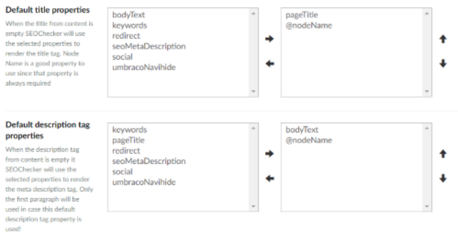
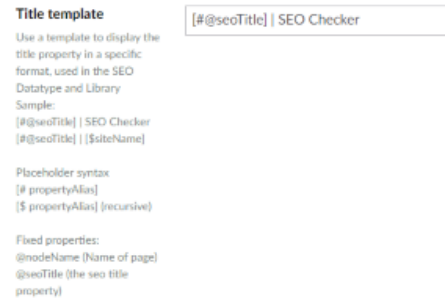

# Document Type settings

Configure defaults for meta data, social, robots and the XML sitemap per Document Type.

## Metadata settings

### Default title and description properties

Choose the properties SEOChecker uses for the SEO title and SEO description when a page doesn't have them.

- The **title** is copied from the mapped property.
- The **description** uses the first paragraph of the mapped property.

Use the sort buttons to change the order. SEOChecker uses the first property that has a value.

### Title template

Set a template for the SEO title. SEOChecker uses it for the `<title>` tag, both in the snippet preview and on
the page.

The template can contain fixed text and placeholders:

| Placeholder | Value |
|---|---|
| `[#propertyAlias]` | The property value of the current page. |
| `[$propertyAlias]` | The property value of the current page or its nearest ancestor that has a value. |
| `@nodeName` | The name of the page. |
| `@seoTitle` | The SEO title of the page. |

For example, `@seoTitle | [$siteName]` renders as `<title>Contact | Simple website</title>`.

!!! note
    The title template is only applied when you render the meta tags with SEOChecker. See
    [Render meta tags](../rendering.md).

## Social settings

Choose the default properties for the social title, description and image, the same way as for the meta data.
When you leave them empty, SEOChecker uses the meta data settings.

## Robots settings

Tell search engines how to handle pages of this Document Type. This is in addition to the rules in
`robots.txt`.

- **Robots index** — `index` includes the pages in search results, `noindex` leaves them out.
- **Robots follow** — `follow` lets search engines follow the links on the pages, `nofollow` doesn't.

To override these for a single page, use the [SEO Checker robots](property-editors.md#other-property-editors)
property editor.

## XML sitemap settings

- **Exclude in XML sitemap** — leaves pages of this Document Type out of the XML sitemap.
- **Sitemap priority** — the priority, from `0.1` (lowest) to `1.0` (highest).
- **Change frequency** — how often pages of this Document Type change.

To override these for a single page, use the [SEO Checker XML sitemap options](property-editors.md#other-property-editors)
property editor.
