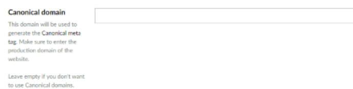
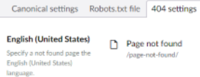

# Domain settings

Use the domain settings to set the canonical domain, the `robots.txt` content and the not found page for each
site (root node).

## Canonical domain

When a site can be reached on more than one domain, set the preferred domain here. Enter the production domain,
even when the site is not live yet.

SEOChecker uses this domain when it renders the canonical URL and other meta data of a page.

!!! tip
    When all root nodes use the same language, it's hard to tell them apart in the domain settings. Set
    [`ShowDomainNameInDomainSettings`](appsettings.md#showdomainnameindomainsettings) to `true` to show the
    domain of each root node.

## Robots.txt

Override the default `robots.txt` content for this site. See [Robots.txt](appsettings.md#robotstxt) for the
default content.

## Not found page

Choose the page to show when a URL can't be found, without changing configuration files. You can set a
different not found page per site and per language.

