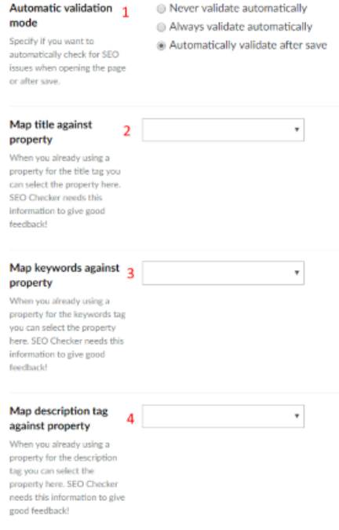
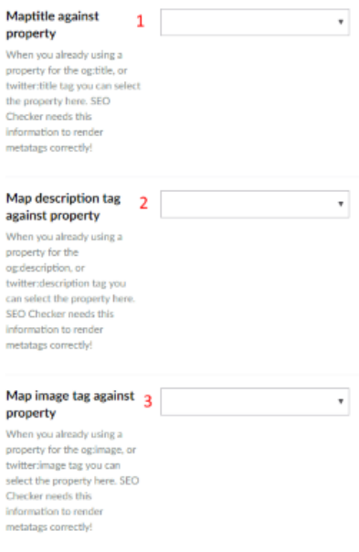

# Property editors

SEOChecker comes with property editors for meta data, social media, robots, the XML sitemap and redirects. This
page describes how to configure their Data Types.

## SEO Checker

By default the SEO Checker property shows fields for the SEO title and description. If your Document Type
already has properties for these, map them in the Data Type.

1. **Automatic validation mode** — whether to check the page for SEO issues never, always when it is opened, or
   after it is saved.
2. **Map title against property** — your existing SEO title property.
3. **Map keywords against property** — your existing keywords property.
4. **Map description tag against property** — your existing SEO description property.

You can also turn on the keywords meta tag.

!!! note
    Google and the other major search engines ignore the keywords meta tag.

## Social

By default the Social property shows fields for the title, description and image. If your Document Type
already has properties for these, map them in the Data Type.

1. Map the social title to an existing property.
2. Map the social description to an existing property.
3. Map the social image to an existing property.

## Other property editors

| Property editor | Use it to |
|---|---|
| **SEO Checker robots** | Override the [robots settings](document-types.md#robots-settings) of the Document Type for one page. |
| **SEO Checker XML sitemap options** | Override the [XML sitemap settings](document-types.md#xml-sitemap-settings) of the Document Type for one page. |
| **SEO Checker redirects manager** | Manage the redirects to one page. See [Redirect manager on a page](../redirects.md#redirect-manager-on-a-page). |
