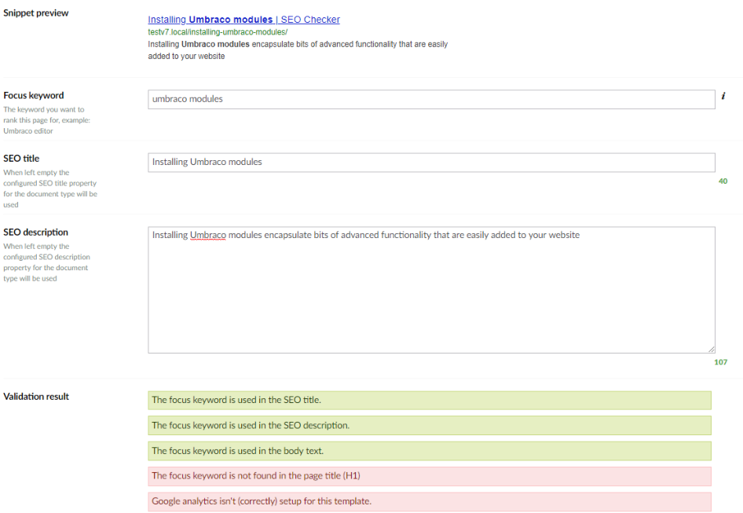

# SEO property

The SEO Checker property editor shows editors how a page appears in Google search results, and checks how well
the page is optimized for a keyword.

Add a property that uses the **SEO Checker** Data Type to your Document Types. To configure it, see
[Property editors](../configuration/property-editors.md#seo-checker).

## Snippet preview

The snippet preview shows the title, URL and description as they appear in Google search results.

!!! note
    The preview needs the `<title>` and `<meta name="description">` tags in the template that renders the page.
    See [Render meta tags](../rendering.md).

## Focus keyword

Enter the keyword you want the page to rank for. SEOChecker checks whether the keyword is used in the most
important parts of the page:

- the page title (`<h1>`)
- the URL
- the SEO title (`<title>`)
- the SEO description (`<meta name="description">`)
- at least once more in the text of the page

The results appear under **Validation result**.

## SEO title and description

Enter the SEO title and SEO description of the page. When you leave them empty, SEOChecker uses the default
properties configured for the Document Type. See [Document Type settings](../configuration/document-types.md).

If your Document Type already has properties for the title and description, you can map those in the Data Type
instead.
