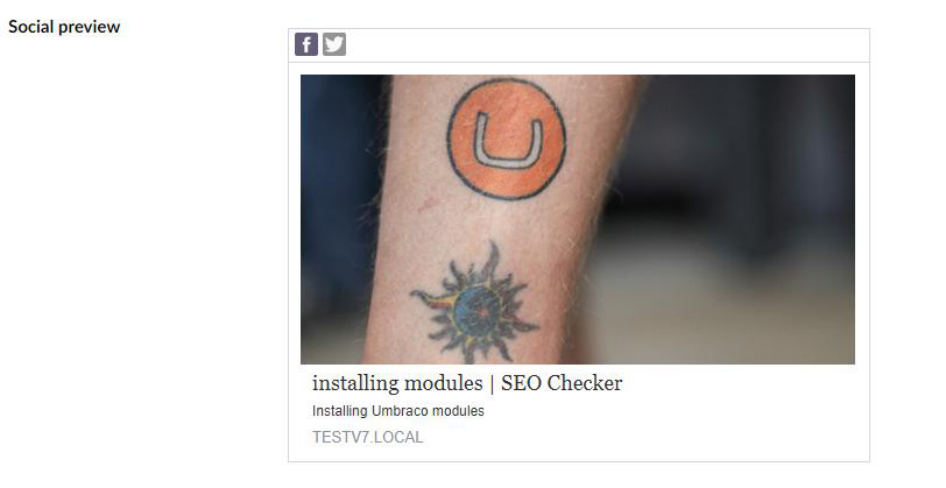
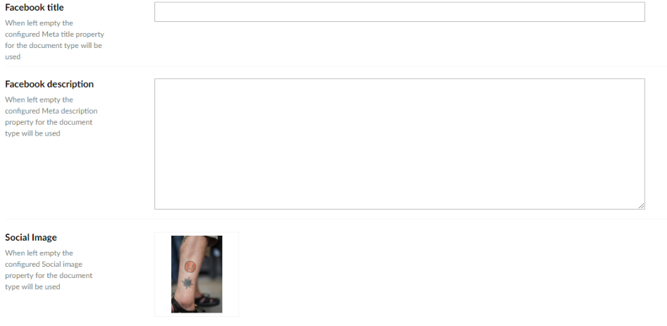

# Social preview

The SEO Checker Social property editor shows how a page appears when it is shared on social media.

| Network | Tags |
|---|---|
| Facebook | Open Graph (`og:*`) title, description and image. |
| X (Twitter) | Its own `twitter:*` title, description and image. |

Each network is turned on separately in `appsettings.json`. Both are off by default. See
[Social settings](../configuration/appsettings.md#socialsettings).

## Override the title, description and image

By default the social preview uses the normal SEO title and description. You can override the title and
description for Open Graph and for X, so you can write for each audience. You can also pick an image from the
Media section.

To configure the Data Type, see [Property editors](../configuration/property-editors.md#social).
