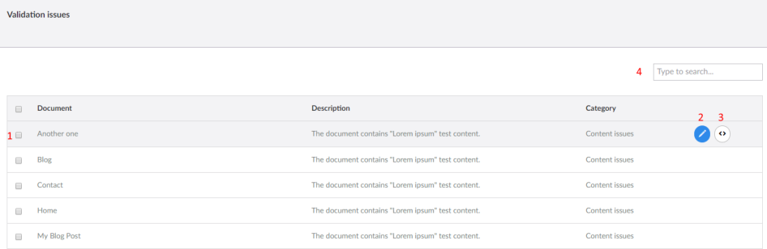
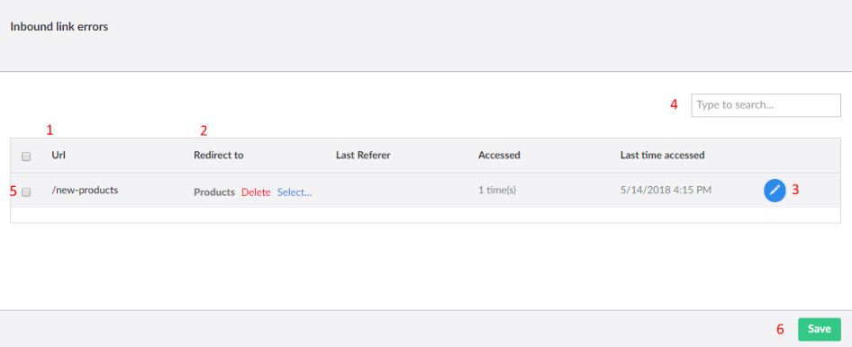
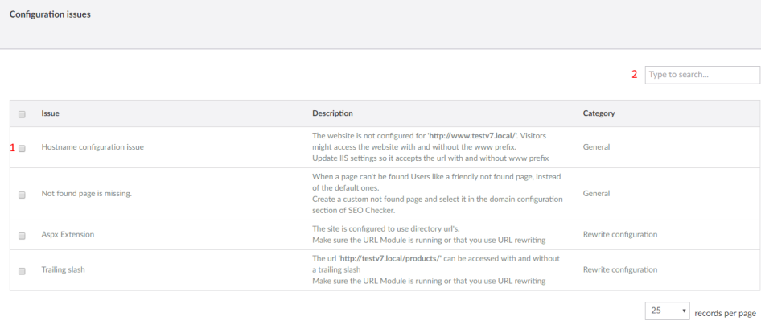
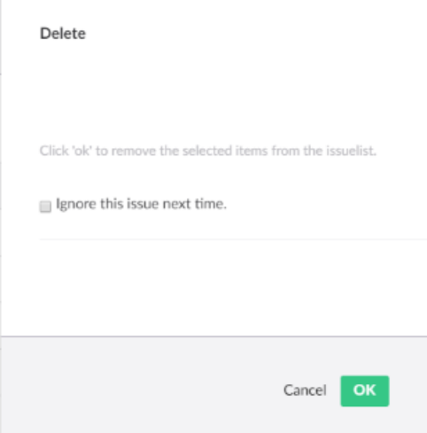

# Issue overviews

SEOChecker collects the issues it finds in three overviews: validation issues, inbound link errors and
configuration errors.

## Validation issues

This overview lists all issues found when validating pages. See [Validation rules](validation-rules.md) for the
checks.

1. Select issues for a bulk action: **Revalidate** or **Delete** the selected items.
2. Open the document.
3. Open the template of the document. Only available to users with access to templates.
4. Search the issues.

## Inbound link errors

SEOChecker logs requests to URLs on your site that don't exist. Some of these it fixes automatically: when a page
is renamed or moved, requests for the old URL are redirected to the new one. For example, when **Modules** is
renamed to **Umbraco Modules**, `/modules` redirects to `/umbraco-modules`.

Links SEOChecker can't fix are listed in this overview.

1. The broken URL.
2. Pick the page to redirect to.
3. Set up the redirect with the advanced options. See [Redirect manager](redirects.md).
4. Search the errors.
5. Select errors for a bulk action: **Assign** them to one page, **Delete** them or **Ignore** them.
6. Save your changes.

After you pick a page, visitors who request the broken URL are redirected to it. You can change the redirect
later in the [redirect manager](redirects.md).

!!! tip
    Broken links that are not fixed are removed automatically after 7 days. See
    [PurgeSettings](configuration/appsettings.md#purgesettings).

## Configuration errors

This overview lists issues in the configuration of the website, such as canonical URL problems or a missing
`robots.txt`.

1. Select issues to delete or ignore them.
2. Filter on a specific issue.

## Delete or ignore an issue

Click **Delete** in any overview to remove an issue.

- **Delete** only removes the issue from the overview. It comes back the next time the page is validated.
- Select **Ignore this issue next time** to add the issue to the [ignore list](configuration/backoffice-settings.md#ignore-lists).
  It is not reported again.
