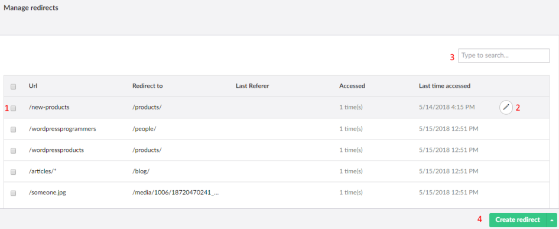
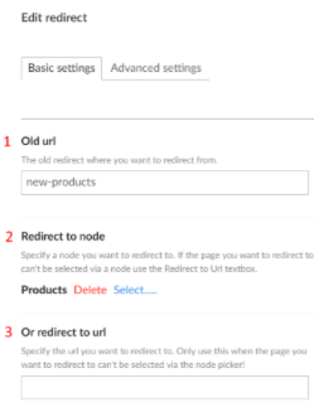
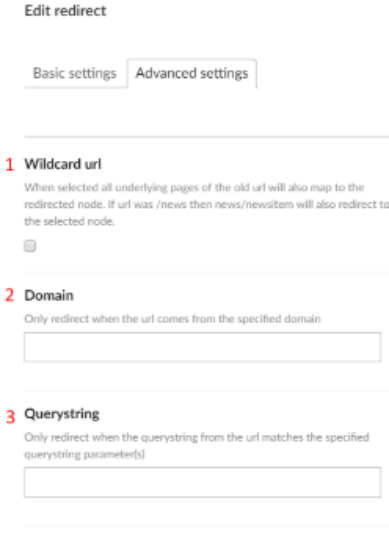
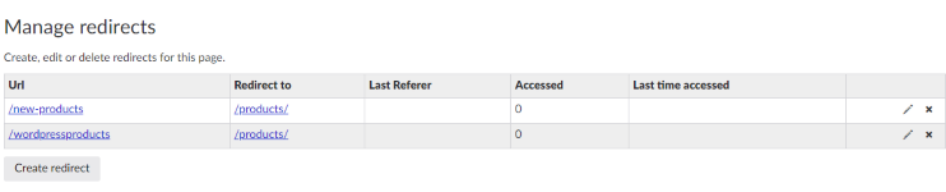
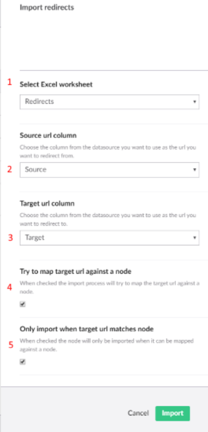

# Redirect manager

The redirect manager lists all redirects on your website and lets you create, edit, import and export them.

For each redirect the overview shows the source URL, where it redirects to and, when available, the last
referrer. It also shows how often the redirect was used and when it was last used, so you can clean up old
redirects.

1. Select redirects to delete them in bulk.
2. Edit a redirect.
3. Search the redirects.
4. Create a redirect.

!!! note
    The **Accessed** and **Last time accessed** statistics are only kept when
    [`RedirectConfig:EnableRedirectStats`](configuration/appsettings.md#redirectconfig) is `true`.

A redirect with a domain or query string only applies to requests with that domain or query string. This lets
you send the same path to different pages, depending on the domain or query string.

## Create or edit a redirect

Click **Create redirect** and enter the URL to redirect from. SEOChecker decides from the file extension
whether this is a content or a media redirect.

### Basic settings

1. The old URL to redirect from.
2. The page to redirect to. For a media redirect this opens the media picker.
3. Or enter a URL to redirect to.

### Advanced settings

1. **Wildcard URL** — redirects every URL below this path too. For example, with `modules` as a wildcard,
   `modules/seochecker` is redirected as well. The overview shows it as `modules/*`.
2. **Domain** — only redirect requests for this domain.
3. **Query string** — only redirect requests that contain this query string.

## Redirect manager on a page

The redirect manager is also available as a property editor: **SEO Checker redirects manager**. Add it to a
Document Type to manage the redirects to that page. It only shows the redirects for the page it is on.

## Import redirects

Users with access to the SEOChecker settings can import redirects from an Excel or CSV file.

1. Open the redirect manager and select **Import redirects** from the menu next to **Create redirect**.
2. Choose the file type (Excel or CSV) and upload the file.
3. Set the import options and click **Import**.

1. The data source options, for example the Excel worksheet.
2. **Source url column** — the column with the URL to redirect from.
3. **Target url column** — the column with the URL to redirect to.
4. **Try to map target url against a node** — SEOChecker tries to link the target URL to a page.
5. **Only import when target url matches node** — only imports redirects whose target URL could be linked to a
   page. Redirects that can't be linked are reported after the import.

!!! tip
    Add `/*` to a URL in the source column to import it as a wildcard URL.

After the import, SEOChecker reports how many redirects were imported and lists any errors. You can export the
failed redirects to Excel, fix them, and import them again.

## Export redirects

Open the redirect manager and select **Export redirects** from the menu next to **Create redirect**. The
redirects and/or broken links are exported to an Excel file.

## Redirects after a URL change

When the name of a content or media item changes, its URL changes too. SEOChecker remembers the old URL and
creates a redirect the first time the old URL is requested. You can turn this off with
[`RedirectConfig:EnableUrlHistoryTracking`](configuration/appsettings.md#redirectconfig).
