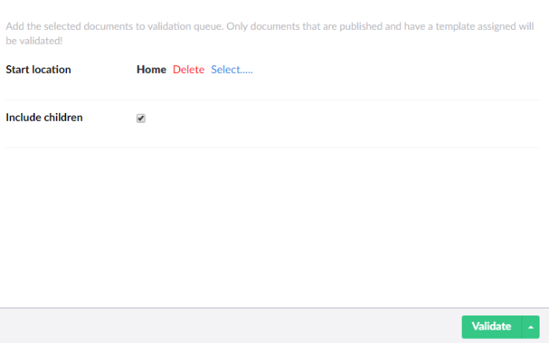
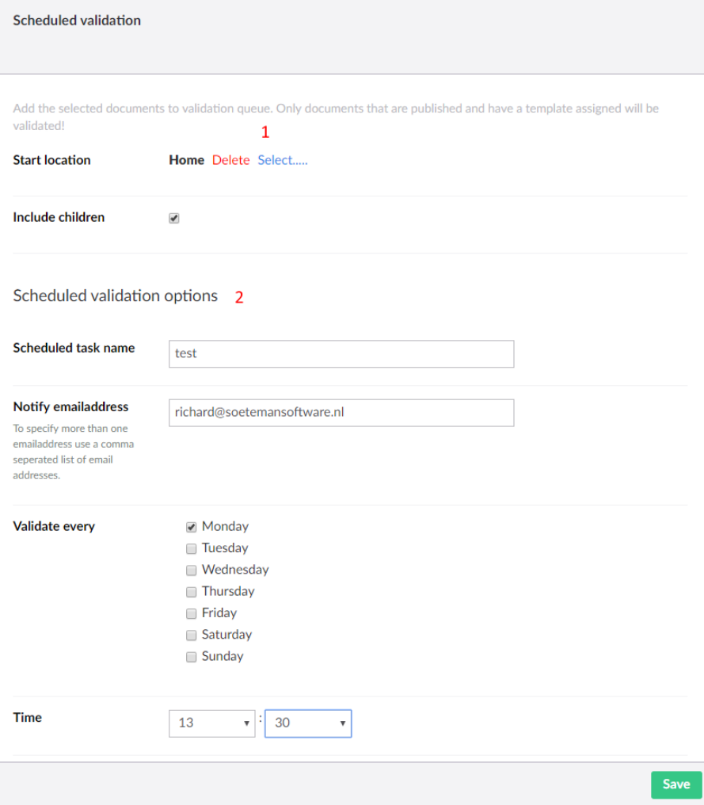
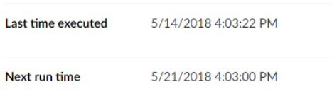
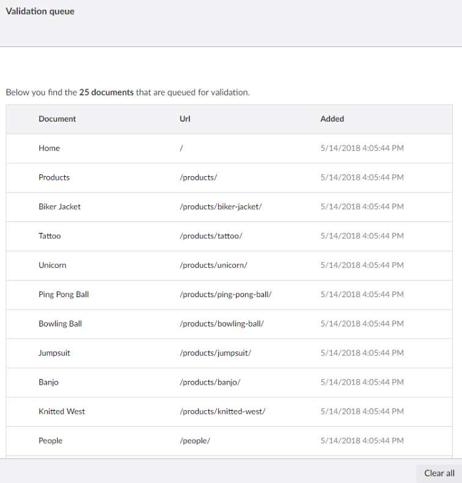

# Validate pages

SEOChecker validates pages manually, automatically when they are published, or on a schedule.

!!! info "Which pages are validated?"
    Only published pages that have a template are validated.

## Validate pages manually

1. Open the **SEO Checker** section and select **Validate Pages**.
2. Choose the **Start location**. By default this is the root of the site.
3. Select **Include children** to validate all published pages below the start location too.
4. Click **Start**.

The pages are added to the [validation queue](#validation-queue).

## Automatic validation

When a page with a template is published, it is added to the validation queue automatically. To turn this off,
set [`Triggers:TriggerOnPublish`](configuration/appsettings.md#triggers) to `false`.

## Scheduled validation

You can validate (parts of) your site at a set day and time.

1. Open the **SEO Checker** section and select **Validate Pages**.
2. Open the menu next to **Validate** and select **Schedule**.
3. Fill in the validation options (1): the **Start location** and whether to **Include children**.
4. Fill in the schedule options (2): a name, the email addresses to notify, and the days and time to run.
   Separate multiple email addresses with a comma.
5. Click **Save**.

You can create more than one scheduled validation, for example to validate different parts of the site on
different days. Saved schedules appear in the tree, and show when they last ran and when they run next.

To change the notification email, see [Email settings](configuration/backoffice-settings.md#email-settings).

## Validation queue

Pages aren't validated right away. They are added to the validation queue and validated in the background, so
you don't have to wait. When the queue is empty, the results are in the
[validation issues](issues.md#validation-issues) overview.

