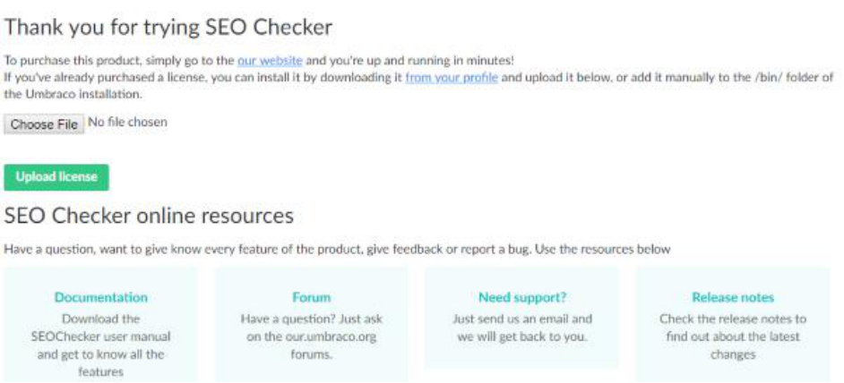
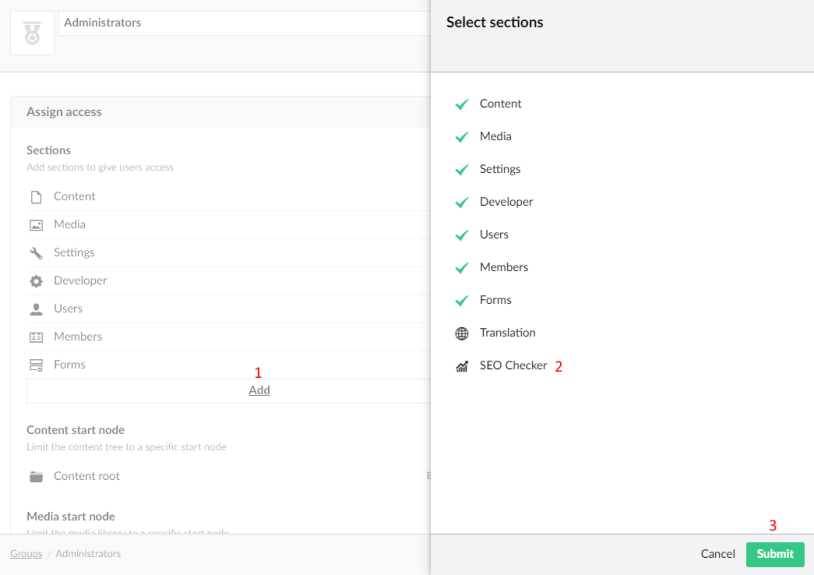

# Installation

This page explains how to install SEOChecker, add your license and give users access.

## Install the package

Install SEOChecker from NuGet in your Umbraco project:

```bash
dotnet add package SEOChecker
```

Run the site. SEOChecker creates its database tables and finishes the installation on the first request to the
website. You now have an **SEO Checker** section in the backoffice.

!!! note
    The database user of your site needs rights to create tables.

## Add your license

Download your license file from your account, then add it in one of these ways:

- **Upload it in the backoffice.** Open the **SEO Checker** section. While SEOChecker runs in trial mode, the
  dashboard shows where to upload the license.
- **Copy it to disk.** Place the license file in the `umbraco/Licenses` folder of your site.



## Give users access

The user group of the user who installed SEOChecker gets access to the **SEO Checker** section automatically.
To give another user group access:

1. Go to the **Users** section and open the user group.
2. Under **Sections**, add **SEO Checker**.
3. Save the user group.



You can also set what each user group may do inside SEOChecker. See
[User group permissions](configuration/backoffice-settings.md#user-group-permissions).
